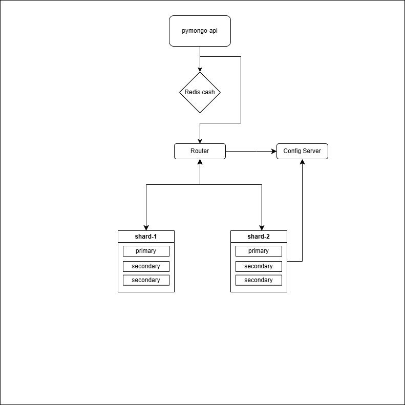

# Задание 4. Кеширование

## Описание
- Применили шардирование к коллекции helloDoc в базе somedb
  - Mongo сама под капотом делает Партиционирование в нашем случае шардирование
  - для осуществления схемы
    - деламе две шарды, регистрируем на роутере
    - добавляем моковые данные в БД
    - проверяем
      - запрос данных из приложения - выдаст все данные
      - запрос данных из роута - выдаст все данные
      - запрос данных из одной шарды - выдаст половину данных так как отработало Шардирование

- применили репликацию шард
  - для каждой шарды сделали две реплики
    - то есть, будет одна Primary, и две Secondary
    - это дает возможность продолжать корректно работать если упадет основная Primary

- добавили кеширование с помощью Redis
  - так как приложение реализовано только на один инстанс, а не на кластер, то добавили один Redis
  - теперь данные будут кешироваться, соответственно после первого запроса, ибо изначально кеш пустой
  - 

## Как запустить
- выполнять из директории/mongo-sharding
```shell
// windows
docker-compose up -d

// если что-то пошло не так 
docker compose down -v

// linuxa 
sudo docker compose up -d 
```

### Настройка 
- добавлены настройки для Redis - ./redis/redis.conf
- запустите скрипт
  - [init.sh](scripts/init.sh)


## Как проверить 
- Проверка шардинга
  - посмотри вывод после выполнения скрипта
    - поле [check_data_shard1]
      - должно быть меньше или больше половины, то есть часть данных храниться на каждой из шард

- проверка репликации
  - Отключи контейнер shard1 (можно и shard2)
  - Откройте в браузере http://localhost:8080
  - запросы должны проходить

- Проверка кеширования 
  - Открой в браузер
    - открой Devtools/Network
    - вставь в поисковую строку http://localhost:8080/helloDoc/users
      - выполни несколько запросов
        - первый запрос будет гораздо дольше чем последующие, значит данные попали в кеш
