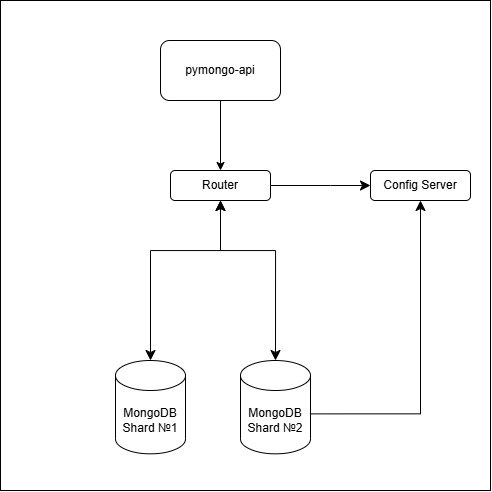

### Используемые порты
- 8080    - приложение (пытон)
- 27017   - Монго - конфиг-сервер
- 27020   - Монго - роутер
- 27018   - Монго - Шард №1
- 27019   - Монго - Шард №1
- 27028  -  Монго - Шард №1 - Реплика 1
- 27029  -  Монго - Шард №2 - Реплика 1

# Шардирование

## Описание
- Применили шардирование к БД согласно схемы
  - [task2.drawio](schemas/task2.drawio)
  - e
  -
## Как запустить
- выполнять из директории/mongo-sharding
```shell
// windows
docker-compose up -d

// linuxa 
sudo docker compose up -d 
```

- настройка сервера конфигурации
```shell
// подключение к контейнеру
docker exec -it configSrv mongosh --port 27017

// иницилизация сервера
rs.initiate(
  {
    _id : "config_server",
       configsvr: true,
    members: [
      { _id : 0, host : "configSrv:27017" }
    ]
  }
);

exit(); 

```

- настройка шарды 1 и его реплики 
```shell
// подключиться к контейнеру шарды 1
docker exec -it shard1 mongosh --port 27018

// иницилизация шарды 1
rs.initiate(
    {
      _id : "shard1",
      members: [
        { _id : 0, host : "shard1:27018" },
         {_id: 1, host: "shard1_repl1:27028"}
      ]
    }
);
  
exit();

```

- инициализация шарды 2 и его реплики
```shell 
// подключиться к контейнеру шарды 2
docker exec -it shard2 mongosh --port 27019

// иницилизация шарды 2
rs.initiate(
    {
      _id : "shard2",
      members: [
        { _id : 1, host : "shard2:27019" },
        {_id: 1, host: "shard2_repl1:27029"}
        
      ]
    }
  );

exit();

```

- настройка роутера
  - привязка шард
  - создание БД  "somedb"
  - заполнение коллекции "helloDoc"
```shell
// подключиться к контейнеру роутера
docker exec -it mongos_router mongosh --port 27020

// добавить шарды в роутер
sh.addShard( "shard1/shard1:27018");
sh.addShard( "shard2/shard2:27019");

// создание БД "somedb"
sh.enableSharding("somedb");

// перекдючиться на БД somedb
use somedb;

// заполнить данными коллекцию helloDoc
for(var i = 0; i < 1000; i++) db.helloDoc.insert({age:i, name:"ly"+i})

// посмотреть количетсво записей из роутера
db.helloDoc.countDocuments()  // покажет 1000, так как собирает данные с двух шард

exit(); 

```

- посмотреть количество документов с разных шард
```shell
// подключиться к контейнеру роутера
docker exec -it shard1 mongosh --port 27018 // либо --port 27019
 
// перекдючиться на БД somedb
use somedb;
 
// посмотреть количетсво записей из шарды
db.helloDoc.countDocuments();  // будет чуть меньше/больше половины загруженных данных
 
exit(); 
```

## Как проверить

### Если вы запускаете проект на локальной машине

Откройте в браузере http://localhost:8080

### Если вы запускаете проект на предоставленной виртуальной машине

Узнать белый ip виртуальной машины

```shell
curl --silent http://ifconfig.me
```

Откройте в браузере http://<ip виртуальной машины>:8080

## Доступные эндпоинты

Список доступных эндпоинтов, swagger http://<ip виртуальной машины>:8080/docs