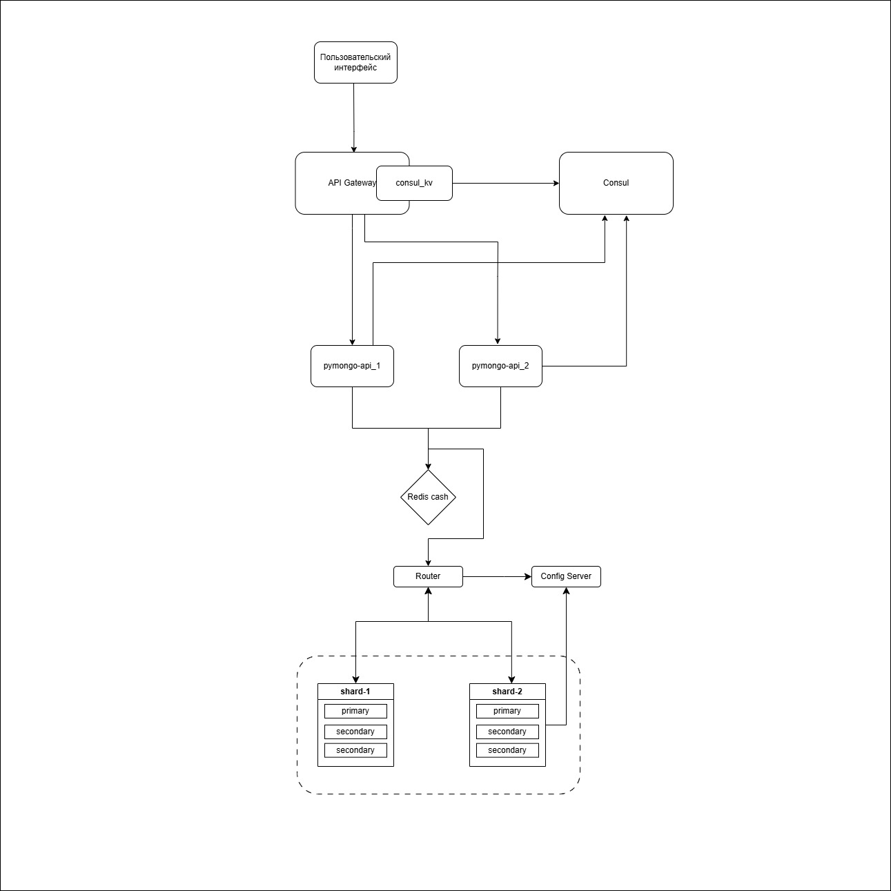

Задание 6. CDN

## Описание
- Применили шардирование к коллекции helloDoc в базе somedb
  - Mongo сама под капотом делает Партиционирование в нашем случае шардирование
  - для осуществления схемы
    - деламе две шарды, регистрируем на роутере
    - добавляем моковые данные в БД
    - проверяем
      - запрос данных из приложения - выдаст все данные
      - запрос данных из роута - выдаст все данные
      - запрос данных из одной шарды - выдаст половину данных так как отработало Шардирование

- применили репликацию шард
  - для каждой шарды сделали две реплики
    - то есть, будет одна Primary, и две Secondary
    - это дает возможность продолжать корректно работать если упадет основная Primary

- добавили кеширование с помощью Redis
  - так как приложение реализовано только на один инстанс, а не на кластер, то добавили один Redis
  - теперь данные будут кешироваться, соответственно после первого запроса, ибо изначально кеш пустой

- добавили балансировщик нагрузки и сервис дискавери
  - API Gateway он же Apisix
  - сервис дискавери - Consul
  - хранилка ключ-значение для Apisix
    - регистрируем сервисы (pymongo 2 штуки) в Consul
    - добавляем маршруты с Apisix до сервисов
    - 

- 

## Как запустить
- Используем Yandex Cloud
  - создаем в облаке Бакет для хранения объектов
    - 5 гигов, имя, чтение публичной, список объектов ограниченный, чтение настроек ограниченное, класс стандартное 
  - после создания заходим в бакет - настройки - веб-сайт
    - хостинг - вводим главная страница - index.html
  - загружаем в Объекты статику - от HTML до JS
    - при успешной загрузке можно проверить шлепнув по ссылке 
      - например, https://mobile-world-by-volkov.website.yandexcloud.net
        - 
  - далее настраиваем доступ CDN для замкадышей (то есть для себя)
    - в консоле Yandex Cloud 
      - выбираем приз или Cloud CDN
        - создать ресурс
      - выбираем Тип источника Бакет - в списке нужный
      - домен ставим свой домен (от Бакета), например mobile-world-by-volkov.website.yandexcloud.net
      - далее можно добавить кеширование например задать Время жизни кеша - от нескольких секунд до 4 дней
      - так же можно добавить HTTP заголовки (даже кастомные)
    - 

- выполнять из директории/mongo-sharding
```shell
// windows
docker-compose up -d

// если что-то пошло не так 
docker compose down -v

// linuxa 
sudo docker compose up -d 
```

### Настройка
- добавлены настройки для Redis - ./redis/redis.conf
- добавлены настройки для Apisix - ./apisix_conf/config.yaml
- запустите скрипт
  - [init.sh](scripts/init.sh)

## Как проверить
- Проверка шардинга
  - посмотри вывод после выполнения скрипта
    - поле [check_data_shard1]
      - должно быть меньше или больше половины, то есть часть данных храниться на каждой из шард

- проверка репликации
  - Отключи контейнер shard1 (можно и shard2)
  - Откройте в браузере http://localhost:8080
  - запросы должны проходить

- Проверка кеширования
  - Открой в браузер
    - открой Devtools/Network
    - вставь в поисковую строку http://localhost:8080/helloDoc/users
      - выполни несколько запросов
        - первый запрос будет гораздо дольше чем последующие, значит данные попали в кеш

- Проверка кеширования 
  - Открой в браузер
    - открой Devtools/Network
    - вставь в поисковую строку http://localhost:8080/helloDoc/users
      - выполни несколько запросов
        - первый запрос будет гораздо дольше чем последующие

- проверка балансировки
  - в браузере открой http://127.0.0.1:9080/pymongo/helloDoc/count
    - должен быть ответ такой как с http://127.0.0.1:8081/helloDoc/count
    - если ответ такой же, значит Gateway отработал
  - отключи контейнер pymongo_api_1
    - так же сделай запрос http://127.0.0.1:9080/pymongo/helloDoc/count - если ответ есть то ОК
