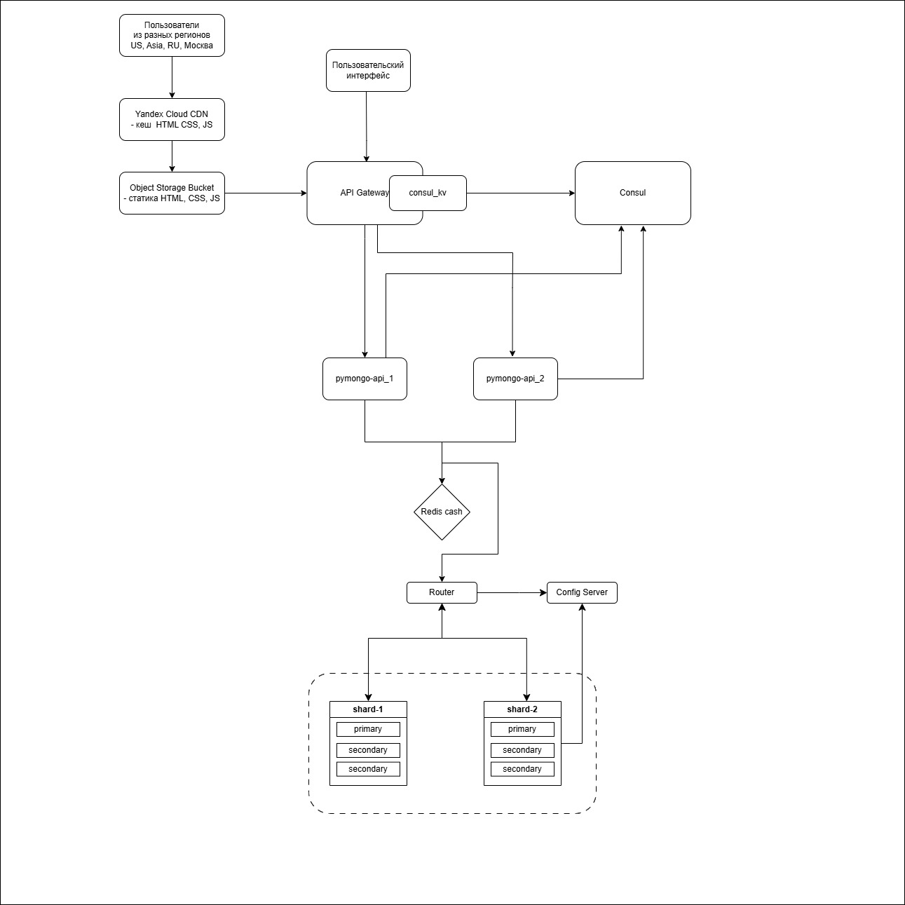
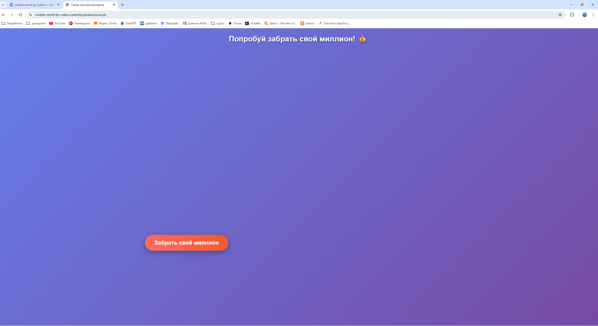
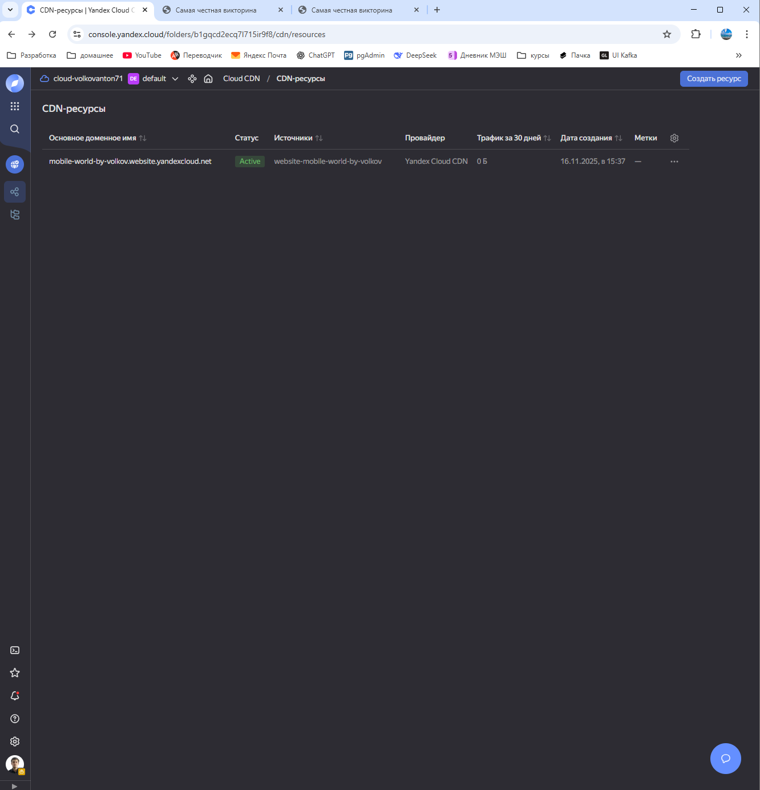

Задание 6. CDN

## Описание
- настраиваем раздачу статики с использованием CDN
  - пока просто рандомный HTML
  - [index.html](static/index.html)
  - схема 

## Как настроить
- Используем Yandex Cloud
  - создаем в облаке Бакет для хранения объектов
    - 5 гигов, имя, чтение публичной, список объектов ограниченный, чтение настроек ограниченное, класс стандартное 
  - после создания заходим в бакет - настройки - веб-сайт
    - хостинг - вводим главная страница - index.html
  - загружаем в Объекты статику - от HTML до JS
    - при успешной загрузке можно проверить шлепнув по ссылке 
      - например, https://mobile-world-by-volkov.website.yandexcloud.net
        - 
  - далее настраиваем доступ CDN для замкадышей (то есть для себя)
    - в консоле Yandex Cloud 
      - выбираем приз или Cloud CDN
        - создать ресурс
      - выбираем Тип источника Бакет - в списке нужный
      - домен ставим свой домен (от Бакета), например mobile-world-by-volkov.website.yandexcloud.net
      - далее можно добавить кеширование например задать Время жизни кеша - от нескольких секунд до 4 дней
      - так же можно добавить HTTP заголовки (даже кастомные)
    - 
